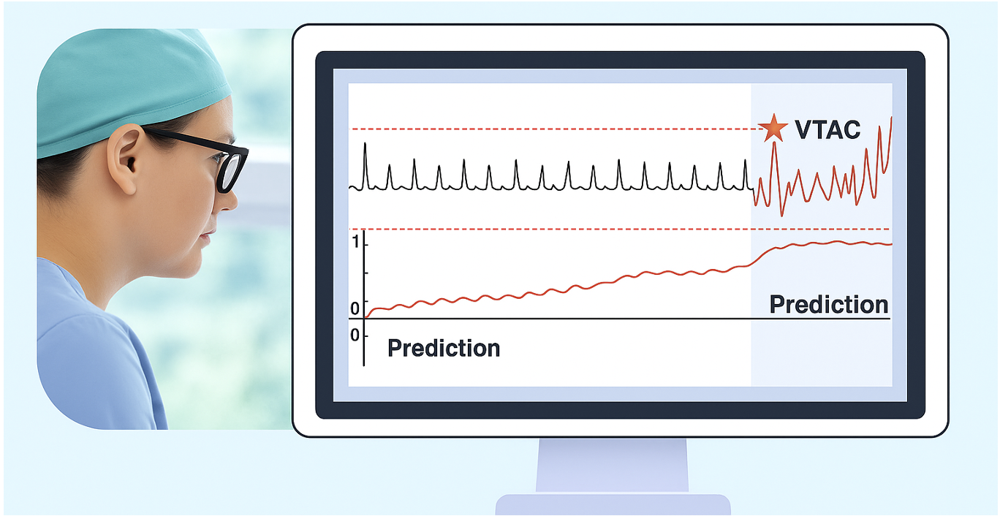
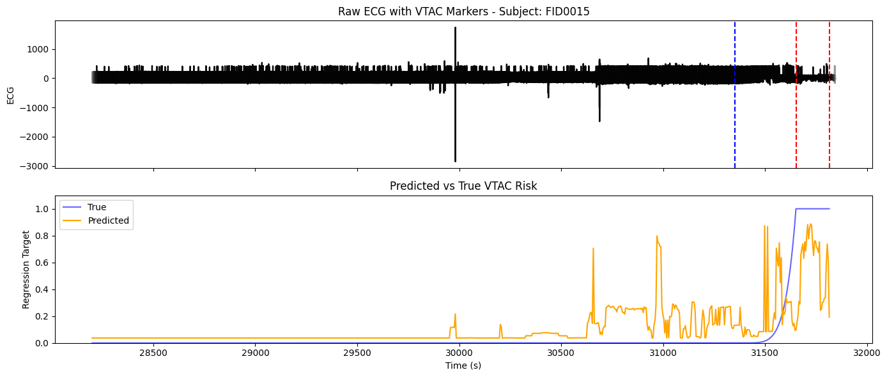
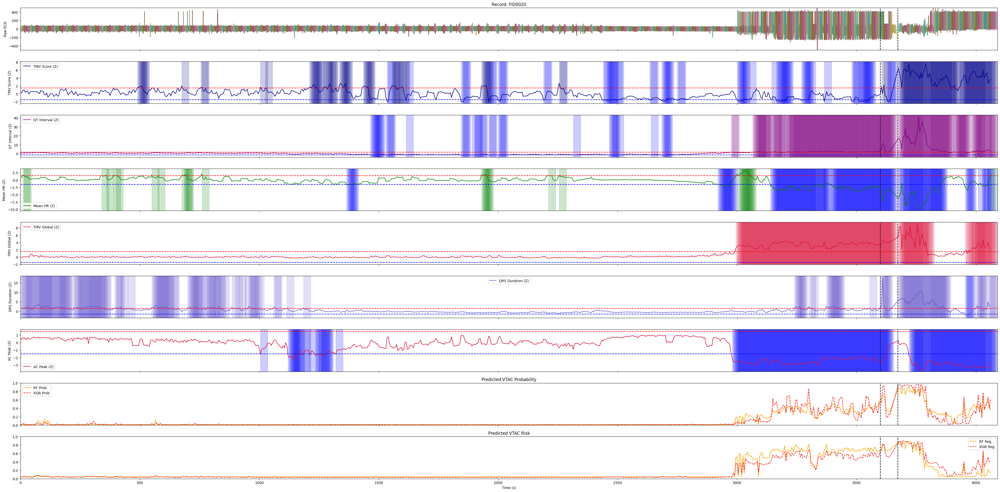

# VTAC Prediction Pipeline

<p align="center">
  
</p>

Lightweight end-to-end pipeline for **Ventricular Tachycardia (VTAC) prediction** from continuous ECG recordings. The pipeline covers sliding-window preprocessing, per-subject causal feature extraction and z-scoring, and ML models (Random Forest / XGBoost) trained with subject-stratified cross-validation.

---

## Overview

| Stage | Notebook | Output |
|-------|----------|--------|
| Preprocessing | `01_preprocessing.ipynb` | `data/processed/zscores_df.pkl` |
| Model development | `02_model_improvement.ipynb` | `model/*.joblib` |
| Validation | `03_model_testing_validation.ipynb` | Plots & metrics |

---

## Project Structure

```
├── 01_preprocessing.ipynb
├── 02_model_improvement.ipynb
├── 03_model_testing_validation.ipynb
├── utils/
│   ├── ecg_windowing.py
│   ├── ecg_features.py
│   └── ecg_plots.py
├── model/
│   ├── random_forest_vtac_model_regression.joblib
│   ├── random_forest_vtac_model_binary.joblib
│   ├── xgboost_vtac_model_regression.joblib
│   └── xgboost_vtac_model_binary.joblib
├── assets/
│   ├── main.png
│   ├── model_training.png
│   └── external_validation.png
├── requirements.txt
└── README.md
```

---

## Setup

```bash
# Python 3.11 recommended
python -m venv .venv
source .venv/bin/activate        # Windows: .venv\Scripts\activate
pip install -r requirements.txt
```

---

## Datasets

Two ECG datasets are combined during preprocessing:

| Dataset | Format | Sampling Rate | Subjects | Source |
|---------|--------|---------------|----------|--------|
| CU Ventricular Tachyarrhythmia Database | WFDB (`.dat`/`.hea`) | 250 Hz | `cu01`–`cu35` | PhysioNet |
| VTSampleData | MAT files | 240 Hz | `Case_XXXX`, `FID####` | Local |

> VTAC intervals are inferred from WFDB annotations (`[`, `]`) for the CU dataset and from `VTSampleData/alarms.csv` for MAT-format records.

---

## Pipeline

### 1 — Preprocessing (`01_preprocessing.ipynb`)

- Reads WFDB and MAT records from their respective directories
- Creates 30-second sliding windows with 5-second shifts
- Applies a signal quality check: windows with clipping ratio > 10–15% (MAD-based) are flagged
- Extracts ECG features per window (see [Feature Glossary](#feature-glossary))
- Computes **causal, subject-specific z-scores** using IQR-based robust statistics over past windows only (minimum 60-window history)
- Filters `Case_*` subjects to those with ≥ 350 valid windows
- Saves the combined feature table:

```python
import pandas as pd
zscores_df.to_pickle("data/processed/zscores_df.pkl")
# Load: pd.read_pickle("data/processed/zscores_df.pkl")
```

### 2 — Model Development (`02_model_improvement.ipynb`)

The figure below shows feature dynamics and model behavior during cross-validation:

<p align="center">
  
</p>

- Defines a **regression target**: a power ramp (`t_norm^6`) over the 300 seconds preceding VTAC onset, reaching 1.0 during VTAC
- Trains **XGBoost** and **Random Forest** regressors using `RandomizedSearchCV` (50 iterations, 3-fold inner CV)
- Splits subjects into 5 folds, balanced across CU / Case / FID cohorts (`GroupKFold`-style)
- Applies a median filter (`kernel_size=5`) to smooth per-subject predictions
- Reports per-fold and pooled RMSE; plots feature importance and SHAP values
- Excludes 10 subjects with poor signal quality: `cu01`, `cu02`, `cu12`, `cu14`, `cu21`, `cu30`, `cu31`, `cu33`, `cu34`, `cu35`
- Saves final models trained on all available data to `model/`

### 3 — Testing & Validation (`03_model_testing_validation.ipynb`)

- Runs the full preprocessing pipeline on held-out FID subjects
- Loads locked model artifacts and generates dual predictions (binary + regression)
- Plots predicted VTAC risk against the ground-truth VTAC timeline

The figure below shows an example of predicted VTAC risk compared to ground truth:

<p align="center">
  
</p>

---

## Utilities

```python
from utils.ecg_windowing import window_vtac_records
from utils.ecg_features import process_dataframe, create_windowed_ecg_from_mat, convert_and_relabel_windowed_df_full
from utils.ecg_plots import compute_refs_and_zscores, plot_subject_panels
```

---

## Feature Glossary

### Temporal / HRV

| Feature | Description |
|---------|-------------|
| `Mean_HR` | Mean heart rate within the window |
| `Max_HR` / `Min_HR` | Peak and trough HR within the window |
| `RMSSD` | Root mean square of successive RR differences |
| `SDNN` | Standard deviation of RR intervals |

### T-Wave

| Feature | Description |
|---------|-------------|
| `QT_Interval` | Mean QT interval (ms) |
| `TMV_Score` | **Local T-wave morphology variability** — mean squared deviation between each beat's T-wave and the window-averaged T-wave. Captures acute, beat-to-beat repolarization instability within the window. |
| `TMV_Global` | **Global T-wave deviation** — MSE between the current window's averaged T-wave and an evolving subject-specific reference (median of past windows). Tracks gradual, sustained repolarization changes relative to the subject's own baseline. |
| `T_Flatness` | Flatness of the T-wave morphology |
| `TWAmp_Std` / `TWAmp_CV` | Standard deviation and coefficient of variation of T-wave amplitude across beats |

### QRS / ST

| Feature | Description |
|---------|-------------|
| `QRS_Duration` | Mean QRS complex duration |
| `QRS_Area` | Area under the QRS complex |
| `QRS_Skewness` | Morphological skewness of the QRS |
| `QRS_Global` | MSE between current and evolving reference QRS shape |
| `ST_Deviation_Mean` | Mean ST-segment deviation from isoelectric line |
| `ST_Slope_Mean` | Mean slope of the ST segment |

### Autocorrelation

| Feature | Description |
|---------|-------------|
| `AC_ECG_Peak` | Peak autocorrelation of the raw ECG signal |
| `AC_ECG_Lag_Sec` | Lag (seconds) at which ACF peak occurs |
| `AC_ECG_MeanAroundPeak` | Mean ACF value in the neighbourhood of the peak |
| `AC_RR_Peak` | Peak autocorrelation of the RR interval series |
| `AC_RR_Lag_Beats` | Lag (beats) at which RR ACF peak occurs |
| `AC_RR_MeanAroundPeak` | Mean RR ACF value around the peak |

All features are also available as **causal robust z-scores** (suffix `_Z`), computed using the IQR method (`z = (x − median) / (IQR / 1.349)`) over past windows only and clipped to [−10, 10].

---

## Reproducibility

- `random_state=42` used in all model and search steps
- Excluded subjects and feature sets are documented in `02_model_improvement.ipynb`
- Default window: **30 s**, shift: **5 s**
- Causal z-scoring requires a minimum of **60 prior windows** (~5 minutes) before producing valid scores

## License

This project is licensed under the MIT License — see the [LICENSE](LICENSE) file for details.
